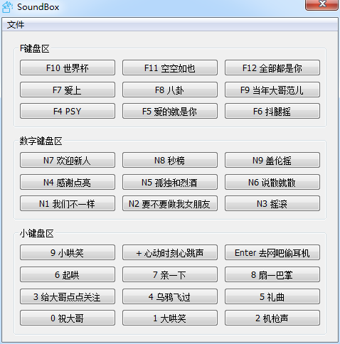

此程序用于播放一些指定音频

程序的按钮名称, 要播放的音乐, 全局快捷键需要通过配置文件 mcfg.table 来指定, mcfg.table在程序运行后会被格式重新写入, 可读性比较差, 所以在mcfg.table.bk中编写, 完成后保存然后另存覆盖掉mcg.table就可以了. 

为什么写这个程序?
废话, 当然是有需求嘛. 当时有考虑过python来写, 但一来对用python写GUI程序不是很熟悉, 二来python程序最后生成的exe文件大小实在是有点感人. 而除了C语言还熟悉一点外其它语言就不太懂了, 听说C#挺好, 但是VS那个体积.....VB和Delphi其实都考虑过, 不喜欢VB的语法, Delphi....记得安装开发环境还是挺麻烦的, 突然想起aardio这个小软件, 于是下载下来, 看了一下例子就撸起袖子干了, 结果还是挺满意的. 

代码中有一点需要手动更改的, 就是main.aardio开头import完库后初始化控件的时候. 因为没找到在aardio中怎么获取所有控件的方法, 但是发现 .add 函数返回的是控件的集合, 由于程序需要遍历控件, 所以在里加了一行代码:

ctrls = SoundBox.add(.....

但是切换到界面设计视图一但修改界面后这个代码会被改掉, 所以记得要手动加上. 

